# 📱 BluCidadão

O *BluCidadão* é um aplicativo inovador que centraliza os principais serviços públicos de Blumenau, oferecendo praticidade, acessibilidade e transparência em um único lugar.

## 🚀 Funcionalidades
  
  ✔️ **Interface intuitiva**: acesso rápido a serviços essenciais
  
  ✔️ **Serviços integrados:** saúde, educação, emprego, documentos, utilidades e mais
  
  ✔️ **Ouvidoria digital:** registro, acompanhamento e transparência em tempo real
  
  ✔️ **Mobilidade e praticidade:** disponível a qualquer hora, em um único app

## 🖼️ Screenshots

   
  
  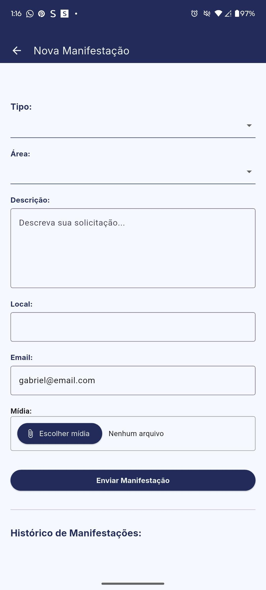

 

   
  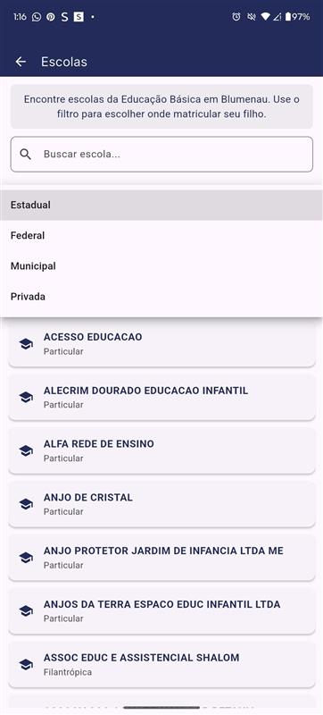
  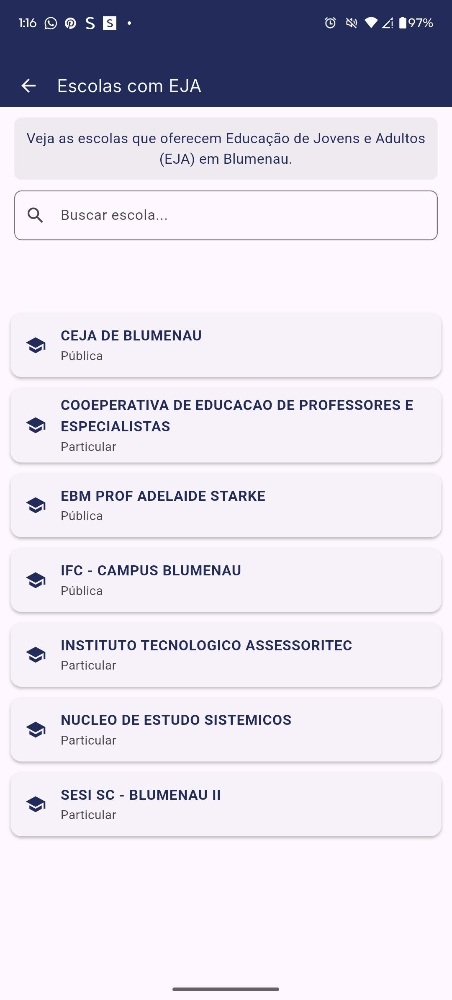

 

  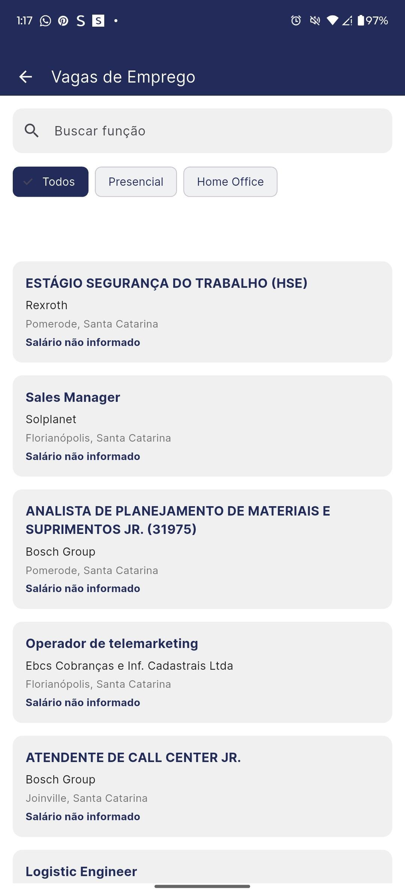 
  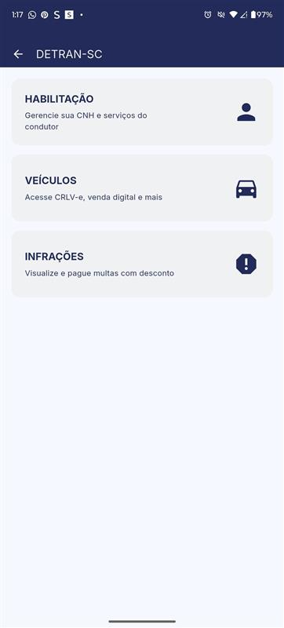
  

 

  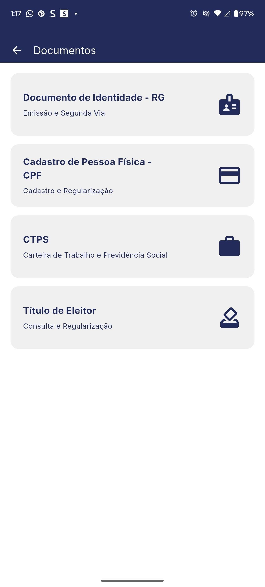 
  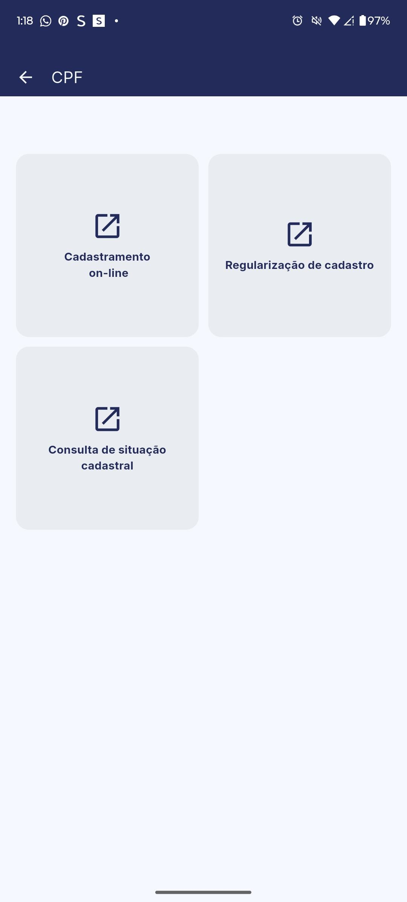
  

   
  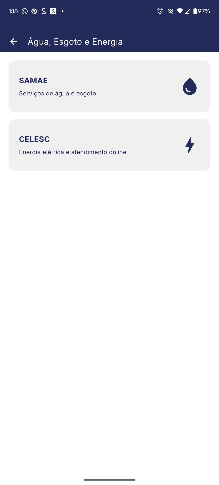
  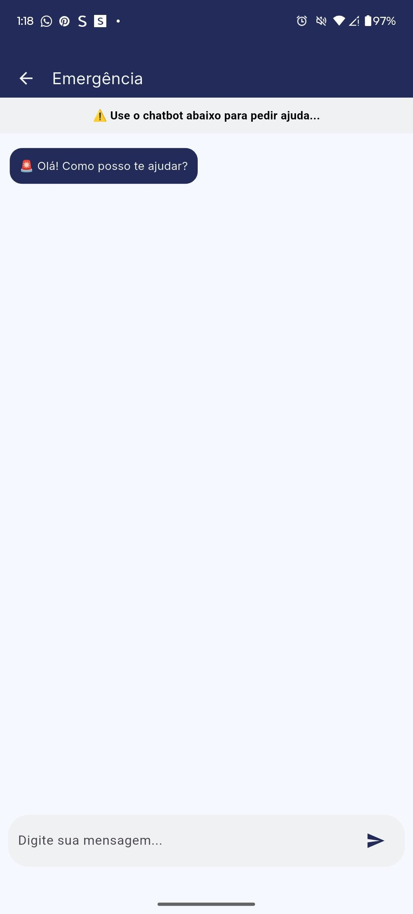

  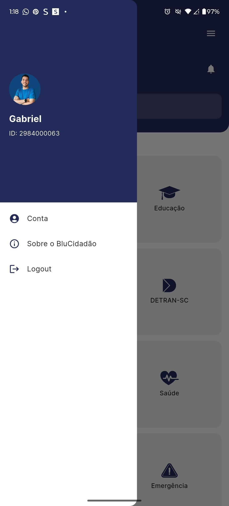 
  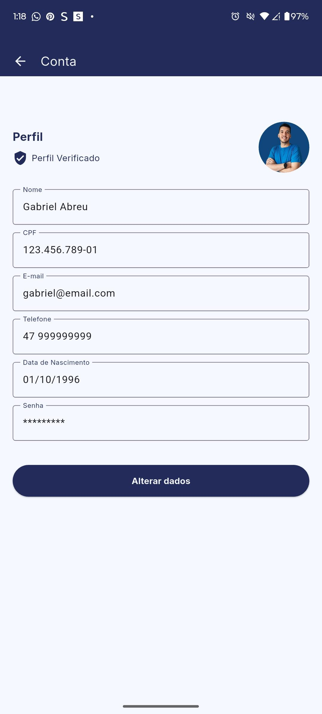
  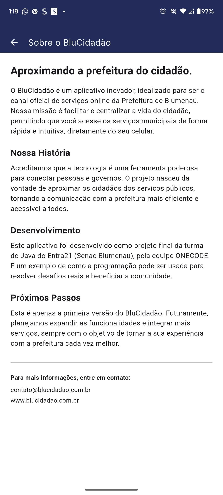

## 🛠️ Tecnologias Utilizadas

  - **Front-End:** Flutter + Dart
  
  - **Back-End:** Spring Boot (Java)
  
  - **Banco de Dados:** MySQL

## 🧩 Futuras Melhorias
  
  - 🔐 Autenticação com OAuth2/JWT
    
  - 🌎 Integração com mapas e geolocalização
    
  - 📊 Dashboard para gestores públicos
    
  - 💬 Chat em tempo real para suporte ao cidadão

  

